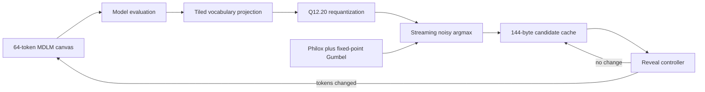

# DiffusionAccel

Model-specific hardware exploration for masked diffusion language models.

DiffusionAccel follows one real 169.6M-parameter MDLM-OWT checkpoint from
macOS inference into bit-accurate numerical models, native C++ kernels,
streaming SystemVerilog, and FPGA resource screens. The current public-ready
result is the diffusion sampling and memory subsystem. The complete DDiT
accelerator remains experimental and does not yet fit or run on a KV260.

> **v0.1 status:** research prototype. Candidate caching, sampling kernels, and
> their focused tests are the stable release surface. Vendor place-and-route,
> board timing, power, and end-to-end FPGA text generation have not been
> demonstrated.

## Why this exists

Masked diffusion language models repeatedly evaluate a bidirectional
Transformer while revealing a block of tokens. Their memory behavior differs
from conventional autoregressive decoding:

- a changed token can invalidate active-block K/V state;
- a transition that changes no tokens can skip the next model evaluation for
  a checkpoint without time conditioning;
- a sampled candidate can replace a retained position-by-vocabulary
  probability tensor until the input changes;
- the output projection and categorical sampler can stream directly into a
  compact candidate cache.

DiffusionAccel makes those rules explicit and tests them from Python through
RTL.



## Reproduced results

| Result | Value | Evidence class |
| --- | ---: | --- |
| FP16 probability cache | 6,433,024 bytes | Derived from 64 x 50,258 entries |
| Candidate cache | 144 bytes | Implemented representation |
| Cache-state reduction | 44,674x | Analytic and tested |
| Candidate factorization maximum error | `1.11e-16` | Float64 analytic check |
| Monte Carlo total-variation distance | `0.003102` | 500,000 trials |
| 64-step model evaluations | 64 to 38 | Measured Apple MPS trace |
| 64-step model-forward time | 1,253 ms to 704 ms | Measured Apple MPS trace |
| Fused replay peak SRAM | 2.868 MiB to 0.375 MiB | Analytical KV260-class replay |
| Fused replay external traffic | 7.301 GB to 6.804 GB | Analytical KV260-class replay |
| Fused replay modeled latency | 947.65 ms to 925.33 ms | Analytical, not board timing |

The memory reduction is the primary result. Fusion alone changes the modeled
latency by only 2.35 percent because the dense vocabulary projection remains.

The open UltraScale+ map of the standalone reveal controller reports 97 LUTs,
33 flip-flops, 14 carry elements, and no DSP, BRAM, or UltraRAM. The larger
accumulator-to-candidate boundary reports 74 DSPs, 5,117 LUTs, 2,123
flip-flops, 2 BRAMs, and 14 distributed-memory primitives. These are Yosys
technology maps, not Vivado implementation results.

## Component status

| Component | Status |
| --- | --- |
| Trace IR and memory simulator | Tested |
| Real MDLM-OWT macOS adapter | Tested, model download required |
| Exact no-change model-forward reuse | Tested on real checkpoint traces |
| Distribution-equivalent candidate cache | Tested |
| Native candidate-reveal kernel | Tested with a C++17 compiler |
| Philox, fixed-point Gumbel, noisy argmax RTL | Tested in focused simulations |
| Fixed-shape MLP and attention operators | Experimental |
| Complete DDiT shared-array integration | In progress, current flow control work is not release-stable |
| KV260 AXI top | Simulation artifact only |
| Vivado timing, bitstream, power, and board output | Not completed |

The last clean open-source complete-top screen used 183,645
CLB-LUT-equivalent primitives and 162.5 BRAM36-equivalent blocks, which exceed
the documented raw K26 capacities. It is not a fit claim.

## Quick start on macOS or Linux

Requirements:

- Python 3.9 or newer
- a C++17 compiler for the native kernel test
- Icarus Verilog for the RTL test
- PyTorch for the numerical candidate-cache validation

```bash
python3 -m venv .venv
source .venv/bin/activate
python -m pip install --upgrade pip
python -m pip install -e '.[dev,analysis]'
```

Run the compact-cache validation:

```bash
diffusion-accel validate-candidate-cache \
  --positions 64 \
  --vocabulary-size 50258 \
  --transitions 64 \
  --monte-carlo-trials 500000 \
  --out /tmp/candidate-cache-equivalence.json
```

Run the focused v0.1 checks:

```bash
python -m pytest -q \
  tests/test_candidate_cache.py \
  tests/test_candidate_kernel.py \
  tests/test_candidate_rtl.py \
  tests/test_gumbel_lut_generation.py \
  tests/test_philox_iterative_rtl.py \
  tests/test_philox_farm_rtl.py \
  tests/test_gumbel_dual_rtl.py \
  tests/test_philox_gumbel_farm_stream_rtl.py \
  tests/test_ordered_noisy_argmax_reducer_rtl.py \
  tests/test_philox_noisy_argmax_stream_rtl.py \
  tests/test_philox_accumulator_argmax_stream_rtl.py
```

Compile the portable candidate-reveal kernel directly:

```bash
c++ -std=c++17 -O2 -Wall -Wextra -Werror \
  hls/candidate_sampler/candidate_sampler.cpp \
  hls/candidate_sampler/candidate_sampler_test.cpp \
  -o /tmp/diffusion_accel_candidate_sampler_test

/tmp/diffusion_accel_candidate_sampler_test
```

## Real checkpoint experiment

The real model path uses the Apache-2.0
[`kuleshov-group/mdlm-owt`](https://huggingface.co/kuleshov-group/mdlm-owt)
checkpoint pinned in `configs/models/mdlm_owt_169m.yaml`. Model weights are not
stored in this repository.

```bash
python -m pip install -e '.[dev,model]'

diffusion-accel trace-mdlm \
  --out /tmp/mdlm-owt-ddpm-cache.jsonl \
  --device auto \
  --canvas-tokens 64 \
  --steps 64 \
  --sampler ddpm-cache
```

The checkpoint uses custom Hugging Face model code. Review that code and the
pinned revision before enabling remote-code loading in a new environment.

## Repository map

```text
src/diffusion_accel/     Python reference models, tracing, and analysis
hls/                     Portable C++ kernels with optional Vitis directives
rtl/candidate_reveal/    Compact cache-hit reveal controller
rtl/philox_gumbel/       Counter-based random and Gumbel score stream
rtl/output_head/         Requantization and streaming noisy argmax
rtl/tensor_engine/       Experimental fixed-shape DDiT operators
configs/                 Frozen model, precision, and hardware assumptions
data/results/            Small checked result records and open maps
docs/                    Design decisions, experiments, and limitations
tests/                   Python, native C++, and RTL checks
```

Start with:

- [`docs/milestone-results.md`](docs/milestone-results.md) for measured results
  and decision history;
- [`docs/memory-strategy.md`](docs/memory-strategy.md) for exact cache lifetime
  rules;
- [`docs/release-status.md`](docs/release-status.md) for the v0.1 validation
  boundary;
- [`docs/roadmap-200m-full-hardware.md`](docs/roadmap-200m-full-hardware.md) for
  the unfinished complete-model roadmap.

## Reproducibility and claim policy

Every result should be labeled as one of:

1. mathematical or bit-accurate reference result;
2. measured host execution;
3. cycle-derived analytical estimate;
4. open-source technology map;
5. vendor implementation result;
6. physical board measurement.

This release contains classes 1 through 4. It contains no class 5 or 6
results. An assumed 250 or 300 MHz clock is never reported as an achieved FPGA
frequency.

## Contributing

See [`CONTRIBUTING.md`](CONTRIBUTING.md). The most valuable contributions are
reproducible numerical counterexamples, tighter fixed-point formats, portable
ready/valid fixes, and vendor reports that include the exact part, tool
version, constraints, timing, utilization, and command transcript.

## License and upstream model

DiffusionAccel is released under Apache-2.0. The MDLM-OWT checkpoint is a
separate upstream work and is also listed as Apache-2.0 on its model card. No
checkpoint weights are redistributed here. Users must review upstream model,
dataset, and generated-output terms for their own use.
